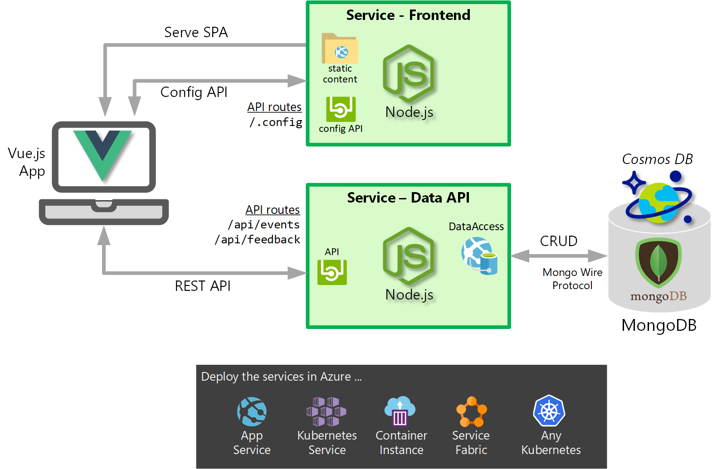
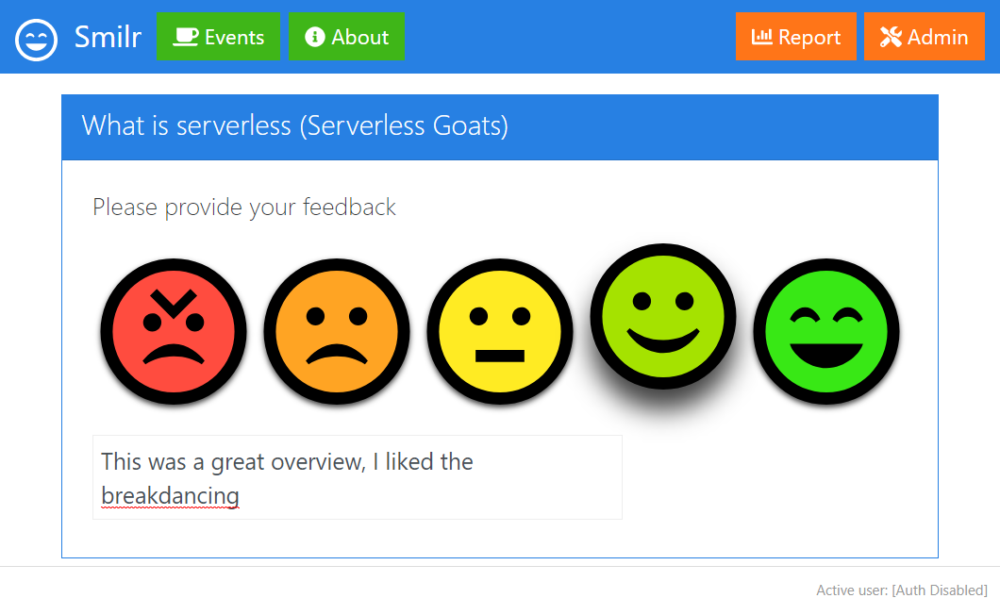

# Smilr - Microservices Reference Project

Smilr is a multi component application & reference architecure. It has been designed to showcase microservices design patterns & deployment architectures. It consists of a front end single page application (SPA), two lightweight services, supporting database and back end data enrichment functions.

The Smilr app is simple, it allows users to provide feedback on events or sessions they have attended via a simple web & mobile interface. The feedback consists of a rating (scored 1-5) and supporting comments.

- The user interface is written in Vue.js and is completely de-coupled from the back end, which it communicates with via REST. The UI is fully responsive and will work on on both web and mobile.
- The two microservices are both written in Node.js using the Express framework. These have been containerized so can easily be deployed & run as containers
- The database is a NoSQL document store holding JSON, provided by MongoDB and/or *Azure Cosmos DB*

The app has been designed to be deployed to Azure, but the flexible nature of the design & chosen technology stack results in a wide range of deployment options and compute scenarios, including:
- Containers: *Azure Kubernetes Service (AKS)* or *Azure Container Instances* 
- Platform services: Regular Windows *Azure App Service (Web Apps)* or Linux *Web App for Containers*
- Serverless compute: *Azure Functions*
- Virtual Machines: Sub-optimal but theoretically possible

This application supports a range of demonstration, and learning scenarios, such as:
 - A working example of microservices design
 - Use of containers, Docker & Kubernetes
 - NoSQL and document stores over traditional relational databases
 - Development and deployment challenges of single page applications 
 - RESTful API design 
 - Platform services for application hosting
 - Using serverless technology to support or provide services
 - Use of an open source application stack such as Node.js
 - The Actor model as an alternative to a traditional data model
 - CQRS (Command & Query Responsibility Segregation) as a possible pattern to separate read and write actions and stores 

---

# Table of Contents

- [Architecture & Core App Components](#architecture--core-app-components)
- [Getting Started](#getting-started)
- [Repository Structure](#repository-structure)
- [Stable Core Implementation](#stable-core-implementation)
- [Fundamentals](#fundamentals)
- [Containers & Kubernetes](#containers--kubernetes)
- [Deploying to Azure](#deploying-to-azure)
- [DevOps CI/CD Pipeline](#devops-cicd-pipeline)
- [Experimental Implementations](#experimental-implementations)
- [Changelog](#changelog)

---


# Architecture & Core App Components
{: .framed .padded}

## Logical Components
The app consists of four logical components
- **Client Vue.js SPA** - The primary web user interface, as a single page application (SPA)
- **Frontend Service** - Serves the above client SPA and acts as runtime config API
- **Data API Service** - Main REST API used by the app for all data access
- **Database** - Backend MongoDB database & persistent store

## Screenshot
{: .framed .padded}

# Getting Started
There are a number of ways to get started with this project depending on your goals. Below are some suggestions and pointers
- [Running Smilr locally with Node.js](./docs/local-dev.md) - If you're a developer interested in the building and running Node.js and/or Vue.js components locally, this is a good place to start.
- [Deploying to Azure from pre-built images](./azure/templates/aci-quickstart) - Probably the quickest way to deploy Smilr is using ARM templates & Azure Container Instances running from pre-built images
- [Deploying to Kubernetes](./kubernetes) - This project is an ideal candidate for running in Kubernetes. Step by step documentation is provided to walk through deployment to Kubernetes and Azure Kubernetes Service


# Repository Structure
This repo contains multiple discreet but loosely dependant code bases. The top levels of the project repository directory tree are laid out as follows 
```
/
├── angular            (Deprecated) The old frontend Angular app
├── azure              Supporting files for Azure deployment etc
│   ├── appservice       Script to deploy frontend to Azure App Service
│   ├── functions        Azure Functions implementation of the data-api service
│   └── templates        Example ARM templates
├── docs               Documentation
├── dotnet             .NET Core ASP implementation of the services - WIP
├── etc                Supporting files, pictures and other artefacts 
├── kubernetes         Docs and files to support deployment to Kubernetes & AKS
│   ├── helm             Helm chart for deploying Smilr with Helm
│   ├── using-ingress    Deployment YAML for use with K8S Ingress
│   └── using-lb         Deployment YAML for use with K8S LoadBalancer
├── node               Main microservices, written in Node.js
│   ├── data-api         Data API service source code
│   └── frontend         Frontend service source code
├── orleans            Orleans actor model implementation of the services  - WIP
├── scripts            Supporting helper scripts
│   └── demoData         Load the database with demo data
├── servicefabric      Service Fabric implementation of the services - WIP
└── vue                The main app frontend, a Vue.js SPA
    ├── src              Source code of Vue.js app
    └── mock-api         Provides a fake API and database for local testing
```


# Stable Core Implementation
The stable & complete version of the Smilr app consists of Node.js implementations of the frontend server & data-api and the Vue.js SPA. There are alternative versions (detailed below) but currently the core of the project is represented this implementation:

#### [:page_with_curl: Vue.js SPA - Documentation](./vue/) 
#### [:page_with_curl: Frontend Server - Documentation](./node/frontend) 
#### [:page_with_curl: Data API - Documentation](./node/data-api) 

### Notes on Security
As Smilr is commonly used in demos, workshops/labs and for self learning, it defaults to being unsecured and open. This makes it easier to deploy without additional configuration or authentication complications.

Should you want to secure Smilr, typically because you want to have a permanent "live" version hosted and accessible, this is also possible. Securing both single page applications and REST APIs presents some interesting challenges. The approach taken was to use [Azure Active Directory v2 for identity](https://docs.microsoft.com/en-us/azure/active-directory/develop/v2-overview), the OAuth2 Implicit Grant flow for authentication and OAuth2 bearer tokens for validation

- [Securing the Vue.js SPA](./vue/#security) 
- [Securing the Data API](./node/data-api#security) 


# Fundamentals
These docs covers some of the fundamental aspects of Smilr, which are independent of any particular implementation
#### [:page_with_curl: API Reference & Data Model](./docs/api-model.md) 
#### [:page_with_curl: Database Notes](./docs/database.md) 

## Runtime Configuration & Settings
The primary configuration mechanism for this project is system environmental variables (or env vars). These env vars are used with the Node.js services, container runtime, Docker tools and helper scripts. This gives a flexible and cross platform way to inject runtime settings, it is also widely supported in Azure (e.g. Azure App Service Settings) and Docker/Kubernetes.

There are numerous ways to set & override environmental variables; in the operating system, the user profile or from command line tools. For local development purposes it is strongly recommended you create & use `.env` files. These are simple text files containing `var=value` pairs. Sample files named `.env.sample` are provided within the project, which you can rename and use. *Note.* `.env` files can often contain secrets so they are prevented from being committed to Git


# Containers & Kubernetes 
As containers and Kubernetes represents such an important build & deployment scenario, they have dedicated guides and documentation

#### [:page_with_curl: Building Smilr as Containers](./docs/containers.md)
#### [:page_with_curl: Running and deploying in Kubernetes](./kubernetes)

### Public Images
Pre built images are available on Dockerhub. Using these will naturally mean you can get started deploying/running Smilr without needing to do anything. However building your own is still recommended, especially if you want to understand the build process in more detail. 

Images for the Node.js data API and frontend (serving the Vue.js client) are available. 
- The `stable` tag is only pushed after some manual validation and testing,
- `latest` is auto-pushed with latest code every night

##### [Smilr on Dockerhub 🡽](https://hub.docker.com/u/smilr)


# Deploying to Azure 
See provided Azure Resource Manager (ARM) templates to allow you to deploy the complete Smilr app and all components to Azure. As all deployment scenarios are container based you also need to refer to the containers section described above

#### [ARM Deployment Templates](./azure/templates)


# DevOps CI/CD Pipeline
Automated CI/CD Pipeline has been created using Azure Pipelines. This automatically builds the various components as containers and releases them to Azure for testing. To view the status of these builds & releases, you can visit the Azure Devops Public Project

| Automated Build | Status |
|---|---|
|Linux Images|[](https://dev.azure.com/bencoleman/Smilr/_build/latest?definitionId=31?branchName=master)|
|Windows Images|[?branchName=master)](https://dev.azure.com/bencoleman/Smilr/_build/latest?definitionId=32?branchName=master)|
|API Tests|[](https://dev.azure.com/bencoleman/Smilr/_build/latest?definitionId=33?branchName=master)|


##### [DevOps Public Project - Smilr 🡽](https://dev.azure.com/bencoleman/Smilr)

If you want to try using Azure DevOps to build Smilr, [the pipelines are provided in the source repo as YAML for your own use](./azure/pipelines). An Azure DevOps account/organisation is required but can be setup for free.


# Experimental Implementations
There are several re-implementations of the Smilr architecture. Either at the backend, providing an API compatible with the data-api REST spec. Also the frontend has been implemented as a mobile app. All of these alternatives are considered experimental and for technology demo use cases 

- [**Serverless - Azure Functions**](./azure/functions)
- [**Bots and Bot Framework**](./bot)
- [**Native Mobile App**](./mobile)
- [**Service Fabric**](./servicefabric)
- [**Actors with Orleans**](./orleans)


# Changelog 
High level project changes and overall history are listed here:
- *Oct 2017* - Project created, using Azure Table storage
- *Nov 2017* - Switched to CosmosDB SQL API (aka DocumentDB)
- *Dec 2017* - Name changed to Smilr
- *Jan 2018* - Simple onetime password security added to API
- *March 2018* - Switched to MongoDB for database
- *May 2018* - Major updates for Kubernetes deployment & Angular 6
- *Dec 2018* - Total rewrite of SPA in Vue.js and proper AAD security
