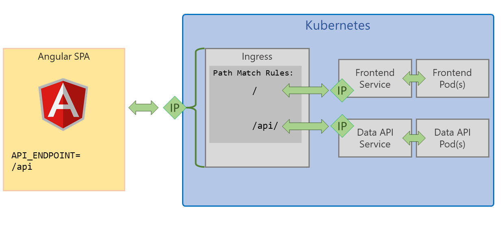
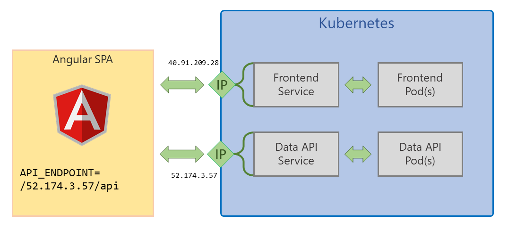

# Kubernetes - Azure Container Service (AKS)


This document covers deploying Smilr into Kubernetes and specifically into Azure Container Service (AKS) 
This assumes you have the latest Azure CLI installed (2.0.21+)

# Set-up & Creation of AKS

This document is not intended to be a step by step guide for deploying Azure Container Service (AKS), if you do not have AKS setup then there are several guides you can use
 - Azure Citadel - [Kubernetes: Hands On With Microservices](https://azurecitadel.github.io/labs/kubernetes/)
 - Azure Docs - [Quickstart: Deploy an Azure Container Service (AKS) cluster](https://docs.microsoft.com/en-us/azure/aks/kubernetes-walkthrough)

> **NOTE.** When creating your AKS cluster it is strongly recommended you use the portal and enable the "HTTP Application Routing add-on" during creation, or create with the `--enable-addons http_application_routing` option. This will automatically enable an ingress controller in your cluster and also provide you with an external DNS zone in Azure, with Kubernetes configured to automatically create records in it. 

---

# Deploying Smilr to Kubernetes

Once you have AKS deployed and are able to interact with it via `kubectl` you can start deploying Smilr to it

## Pre-requisites 
Before starting deploying Smilr into Kubernetes you will need to have an Azure Container Registry (ACR) populated with the Smilr container images. 

Refer to the main container guide for details
#### [:page_with_curl: Complete container guide](../docs/containers.md) 

Notes on Smilr Kubernetes deployment:
- There are numerous places where the configurations refer to a container registry and image. Unfortunately these are not all parameterizable, so you will need to edit files to point to your own registry (ACR)
- When deploying to Kubernetes use of the `default` namespace is assumed.
- Kubernetes version 1.9+ is assumed, if you are using 1.8 or older the API version in the deployment YAML may require changing e.g. to `apiVersion: apps/v1beta1`. Older versions have not been tested.


---


## Option 1 - Helm (Easiest)
[Helm](https://helm.sh/) is a package manager for Kubernetes, and a Helm Chart has been created to deploy Smilr. This means you can deploy Smilr with a single command. The chart is called simply 'smilr' and is in the helm subdirectory 

### Helm & Smilr Quick Start

- Install Helm https://docs.helm.sh/using_helm/#installing-helm
- Add Helm to your Kubernetes cluster: `helm init`
- From root of this project `cd kubernetes/helm`
- `helm install smilr`
- Done!

Full details of using the Helm chart are here:  
#### [:page_with_curl: Helm Chart Docs](helm/readme.md)


---


## Option 2 - Direct Deployment

Deployment YAML files have been provided to directly stand up Smilr in your Kubernetes cluster. Two scenarios are provided, in both cases the deployment has been split into multiple files. 

Before deployment of either scenario the files `frontend.yaml` and `data-api.yaml` will require editing to point to your images and the relevant registry (i.e. ACR) & tag you are using. It is assumed you will be deploying to the default namespace

### Scenario A - Basic
{: .framed .padded}  
**[Deployment Files for this scenario are in /kubernetes/basic](./basic/)** 

This method exposes the two Smilr services externally with their own external IP addresses, using the Kubernetes ***LoadBalancer*** service type. This has the advantage of not requiring any dependency on an Ingress controller but does require some manual editing of the YAML during deployment. 

Note. This scenario also doesn't persist the data for the MongoDB

The steps for deployment are:

1. Modify `data-api.yaml` and `frontend.yaml` and change the `image:` section to point to where your Smilr images are held, i.e. your ACR instance

2. Deploy the data layer
    ```
    cd kubernetes/basic
    kubectl apply -f mongodb.yaml
    kubectl apply -f data-api.yaml
    kubectl get svc data-api-svc -w
    ```
    Wait for `data-api-svc` to get an external IP address assigned, once it has, hit CTRL+C stop waiting. **Note.** This can take about 5-10 minutes in some cases, so be patient.  
    Copy the external IP address and edit `frontend.yaml` modify the `API_ENDPOINT` env URL to point to the data-api IP which was just assigned. You will need to have `/api` as part of the URL, e.g. **http://{data-api-svc-ip}/api**

3. Deploy the frontend
    ```
    kubectl apply -f frontend.yaml
    kubectl get svc frontend-svc -w
    ```
    Wait for `frontend-svc` to get an external IP address assigned, once it has, hit CTRL+C stop waiting.  
    The frontend-svc external IP address is where you can access the Smilr app, e.g. by visiting **http://{frontend-svc-ip}/** in your browser


### Scenario B - Advanced
{: .framed .padded}  
**[Deployment Files for this scenario are in /kubernetes/advanced](./advanced/)** 

This method uses a Kubernetes *Ingress* to provide a single entrypoint into your cluster, and URL path rules to route traffic to the Smilr frontend and data-api as required. This simplifies config as the API endpoint is the same as where the Angular SPA is served from so it doesn't require any fiddling with IP addresses or DNS. 

This scenario also uses introduces persistence to MongoDB:
- Uses a *StatefulSet* rather than a *Deployment* to run the MongoDB component
- Uses a *Persistent Volume* mounted into the pod, to hold the MongoDB data 
- This can result in a ~5 minute wait while this volume is created and bound to the MonogDB pod. Until this pod is ready the Smilr app will not be fully functional.

This scenario does require an ingress controller running in your cluster, which if you enabled "HTTP Application Routing" when creating AKS you will already have. If you don't have this add on, use Helm (e.g. `helm install stable/nginx-ingress`) but you will need to change the **kubernetes.io/ingress.class** in `ingress.yaml` to `nginx`

The steps for deployment of this scenario are:
1. Edit `ingress.http.yaml` or `ingress.https.yaml` and modify the DNS zone/domain to match the one created with your AKS cluster (in the MC resource group). It will take the form of `{random}.{region}.aksapp.io/`. You should only need to do this once
2. Edit `data-api.yaml` and `frontend.yaml` and change the `image:` section to point to where your Smilr images are held, i.e. your ACR instance
3. Run the following
    ```
    cd kubernetes/advanced
    kubectl apply -f mongodb.all.yaml
    kubectl apply -f data-api.deploy.yaml
    kubectl apply -f data-api.svc.yaml
    kubectl apply -f frontend.deploy.yaml
    kubectl apply -f frontend.svc.yaml
    kubectl apply -f ingress.http.yaml
    ```
    Note. If you have setup cert-manager for HTTPS support (See appendix below) then use the `ingress.https.yaml` file instead

4. The app will be available at **`http://smilr.{random}.{region}.aksapp.io/`** If you want to get the IP of your ingress you can run  
    ```
    kubectl get svc -l app=addon-http-application-routing-nginx-ingress --all-namespaces -o jsonpath='{.items[0].status.loadBalancer.ingress[0].ip}{"\n"}'
    ```


---

# Optional Appendix - Enable HTTPS with cert-manager
If you wish to use HTTPS and have certs issued via Let's Encrypt the instuctions for setting that up are below
#### [:page_with_curl: Enabling HTTPS with cert-manager](cert-manager/) 